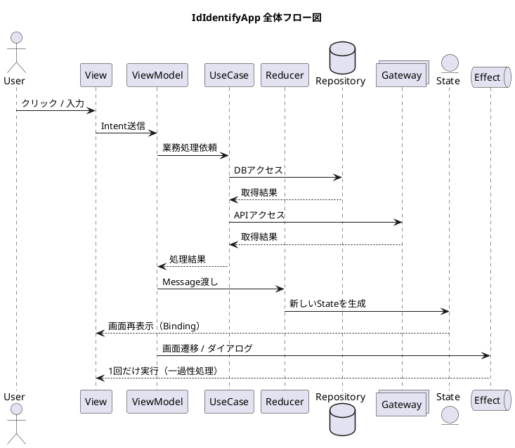
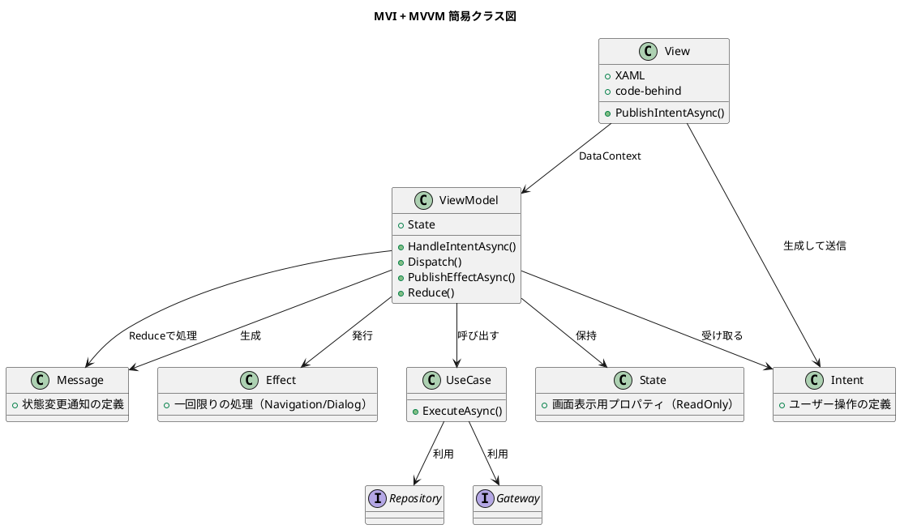
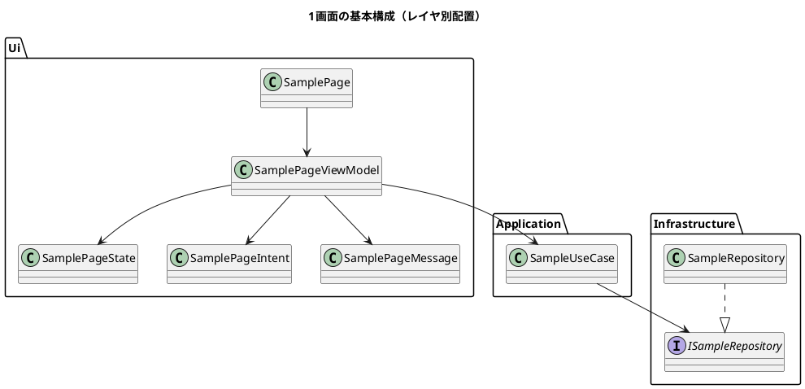
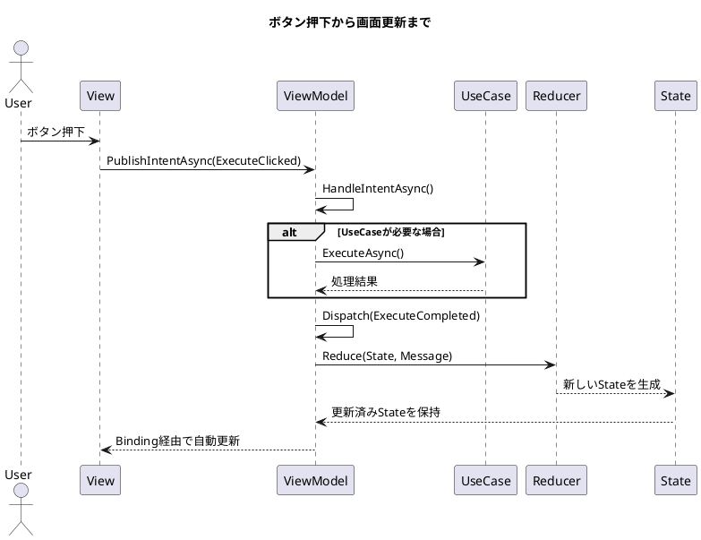
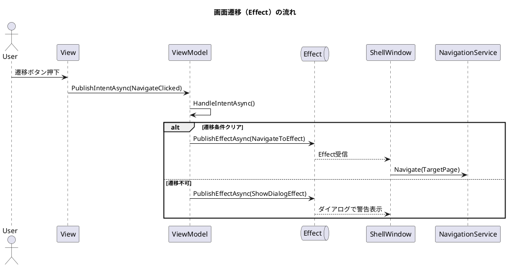

# 🚀 Windowsアプリ 共通基盤カスタマイズガイド

**対象:** `Windowsアプリ` の実装を初めて触るエンジニアの皆様へ ✨

このガイドは、Windowsアプリにおける自走のルールをまとめたものです。
迷ったときはここに戻り、設計思想という名の「OS」に従って実装を進めてください。

---

## 🧭 1. この文書の使い方

### この章はこういうときに見る
- 「どこから読み始めればいいか分からない」とき 🤷‍♂️
- 「今やりたい作業に対応する章をすぐ見つけたい」とき ⚡

### この作業で追加するもの
- **説明のみ**（コードの追加はありません）

### 作業の基本フロー
1. まず **「2. 基本ルール」** で全体の規約をインストールする
2. 次に **「6. 最初に覚える追加パターン」** で実装の流れを掴む
3. 自分のやりたい作業に合わせて **各詳細章（7〜17）** を参照する
4. 最後に **「18. よくある間違い」** でセルフチェックを完了させる ✅

### やりたいこと別・逆引きインデックス
実装に迷ったら、以下の章番号をダイレクトにチェックしてください！
- **画面を追加したい**: 第7章
- **ボタン処理を作りたい**: 第8章
- **DBの値を表示したい**: 第9章
- **設定値を読み込みたい**: 第10章
- **APIを呼び出したい**: 第11章
- **入力バリデーションをしたい**: 第12章
- **保存処理を実装したい**: 第13章
- **画面遷移を制御したい**: 第14章
- **エラーやメッセージを出したい**: 第15章
- **新しいUseCaseを作りたい**: 第16章
- **DI（依存注入）を登録したい**: 第17章
- **ひな形をコピーしたい**: 第19章

### 📝 ソースコードの参照ヒント
- **推奨の読み順:** `2` → `6` → `(必要章)` → `18` → `19`
- **困ったときの参考ソース:**
    - 画面イベントの配線ルール：`CheckPage1.xaml(.cs)`
    - MVIアーキテクチャの核：`AbsViewModel`
    - DI（自動登録）の規約：`Common/Apps/Hosting` 配下

> [!CAUTION]
> **やってはいけないこと（NG）**
> - ❌章を飛ばして我流で実装し、**命名規約や自動登録**を見落とすこと 
> - ❌一般的なMVVMの記事を鵜呑みにして、このアプリ固有の **「Intent → Message → State」** の流れを無視すること 

---

## 🏗️ 2. カスタマイズの基本ルール

### この章はこういうときに見る
- 実装を始める前に「どの情報をどこに書くべきか」の境界線を知りたいとき。

### この作業で追加するもの
- **ルール理解のみ**（コードの追加はありません）

### 実装の標準ワークフロー
このアプリの「OS」は、以下の6つのステップで駆動します。
1. **View (XAML / code-behind):** ユーザー操作を検知し、ただの「Intent（意図）」に変換して飛ばすだけ。🖼️
2. **ViewModel:** Intentを受け取り、UseCaseを呼び、結果を「Message」や「Effect」として発行する司令塔。👨‍✈️
3. **Reducer (Reduceメソッド):** Messageを受け取り、新しい「State（状態）」を生成する。副作用は一切禁止。📝
4. **UseCase:** 「業務処理の単位」として実装。RepositoryやGatewayを駆使して仕事をする職人。👷
5. **Infrastructure (Repository/Gateway):** DBアクセスや外部API通信など、外部世界との接続を一手に引き受ける。🌐
6. **DI (Dependency Injection):** 命名規約による「自動登録」を基本とし、特殊な場合のみ明示的に登録する。💉

### 核心部のコード例
AbsViewModel の絶対ルール
1. State は必ず Dispatch -> Reduce 経由で更新すること
```csharp

protected void Dispatch(TMessage message) {
    State = Reduce(State, message);
}
```
2. 画面遷移などの「一回きり」のイベントは Effect Channel を使うこと
```csharp

protected ValueTask PublishEffectAsync(UiEffect effect, CancellationToken ct = default) {
    return _effectChannel.Writer.WriteAsync(effect, ct);
}
```

> [!CAUTION]
> **やってはいけないこと（NG）**
> - **View** に直接DB操作やAPI呼び出しを書くこと ❌
> - **ViewModel** の中で `Frame.Navigate` を直接叩くこと（Effectを使いましょう） ❌
> - **Reduce** メソッドの中でAPIを呼ぶなどの副作用を起こすこと ❌
> - ダイアログ表示などの「一回限り」のイベントを、**Stateのプロパティ（boolフラグ等）**で管理すること ❌

---

## 🧠 3. このアプリの考え方（MVI＋MVVM思想）

### この章はこういうときに見る
- 「なぜこんなにクラスが細分化されているのか？」と疑問に思ったとき。
- 「全部ViewModelに書けば早いのでは？」という誘惑に駆られたとき。

### 基本の3要素
このアプリでは、複雑さを避けるために処理を物理的に切り分けています。
1. **入力:** ユーザーが何をしたか（Intent）
2. **状態:** 画面に今、何が表示されているか（State）
3. **処理:** どんなビジネスロジックを動かすか（UseCase / Message / Reducer）

###　「全部入りViewModel」の罠（NG例）

> [!CAUTION]
>❌ これをやってしまうと、テスト不能・再利用不可のスパゲッティコードになります
```csharp
public async Task OnClick() {
    var data = await db.Get(); 処理が混ざっている
    if (data == null) {
        ShowError();  副作用が混ざっている
        return;
    }
    Message = data.Name; 状態変更が直接的
    Navigate(); 画面遷移がViewModelに依存
}
```

### このアプリの「正解」の連鎖
```text
ボタン押下 ➔ Intent（入力） ➔ ViewModel ➔ UseCase（処理）
 ➔ Message（結果） ➔ Reducer（状態更新） ➔ State（表示）
```

| アクション | 役割の名称 |
| :--- | :--- |
| 「ボタンを押した」 | **Intent** |
| 「データを取ってきた」 | **UseCase** |
| 「成功した / 失敗した」 | **Message** |
| 「画面をどう書き換えるか」 | **Reducer** |
| 「今の画面の最新状態」 | **State** |

### 「Effect」とは何か？

状態（State）とは別に、**「1回だけ実行したい副作用」**（画面遷移、ダイアログ表示など）を指します。
Stateに入れてしまうと、画面の再描画（Re-render）のたびに何度もダイアログが出てしまうといったバグの原因になります。
これを防ぐために、Effectとして分離しています。

---

## 📖 4. 用語をかんたんに説明

### この章はこういうときに見る
- クラス名を見て「これ何だっけ？」となったときの辞書として。

### 理解のゴール
名前を暗記するのではなく、**「そのクラスが何をする場所（役割）か」** をイメージできること！

| 用語 | 役割 | やること（⭕） | やらないこと（❌） |
| :--- | :--- | :--- | :--- |
| **View** | 画面そのもの | 操作を受け取る | 処理を書く |
| **ViewModel** | 司令塔 | UseCaseを呼ぶ、状態更新の指示を出す | DB/APIを直接呼ぶ |
| **State** | データのかたまり | 今の状態を保持する（変えると画面が変わる） | 一回限りの処理を持つ |
| **Intent** | きっかけ | ユーザーの操作を表す | 状態変更を表す |
| **Message** | 状態変更の指示 | 状態の変化を表す | ユーザー操作を表す |
| **Reducer** | 計算機 | Stateを新しく作り直す | API呼び出しなどの副作用 |
| **Effect** | 単発処理 | 画面遷移、ダイアログ表示 | Stateで管理する |
| **UseCase** | 現場監督 | データ取得、保存、検証などの処理 | UI操作や画面遷移 |
| **Repository** | DB窓口 | DBの保存・取得 | UIや業務ロジックを持つ |
| **Gateway** | API窓口 | 外部通信を行う | UIや状態管理 |
| **Provider** | 値の供給者 | 設定値やトークンを提供する | 処理ロジックを持つ |

> [!CAUTION]
> **やってはいけないこと（NG）**
> - **Intent** と **Message** を混同し、ReduceにUIイベントをそのまま渡すこと ❌
> - **Effect**（一回性）を **State**（永続性）の中に混ぜてしまうこと ❌

---

## 🗺️ 5.　図で見る全体像

### 1. この章はこういうときに見る
- MVI / MVVM のつながりを図で直感的に把握したいとき。
- 「ボタンを押してから画面が変わるまで」の内部的なパスを確認したいとき。
- 実装前に、どのクラスがどの役割を担うべきか、ざっくり掴みたいとき。

### 2. この章のゴール
以下の 3 点を、図を通じて「自分の言葉で説明できる」状態を目指します。
1. **データの一方向流（Unidirectional Data Flow）**
2. **State（状態）と Effect（副作用）の明確な使い分け**
3. **Application 層と Infrastructure 層の分離構造**

## 5.1 全体フロー図（データの一方向循環）

ユーザーの入力から画面反映まで、データがどのように各層を巡るかを示します。




## 5.2 MVI + MVVM 簡易クラス図

各コンポーネントが保持する情報と、その相互関係を整理します。




## 5.3 画面追加時のパッケージ構成図

新しい画面を作る際、どのプロジェクトのどのパッケージにクラスを配置すべきかを示します。



## 5.4 主要なアクションのシーケンス

### ① ボタン押下から画面更新まで（状態変更）




### ② 画面遷移の流れ（一過性処理）



## 5.5 図を読み解くポイント

このアーキテクチャの心臓部は、以下の **「役割の徹底分離」** にあります。

- **View**：UI定義と入力の検知に専念する（ロジックを持たない）。
- **ViewModel**：全体の司令塔。Intentを受け取り、UseCaseを呼び、結果をMessageとして送る。
- **UseCase**：純粋な業務ロジックの実行者。
- **Reducer**：状態計算の専門家。副作用を持たず、新しいStateを作るだけ。
- **Effect**：画面遷移など、Stateで管理すると「二重実行」のリスクがある処理の逃げ道。

## まとめ

図解から分かる通り、このアプリの処理は大きく **2つのバイパス** に分かれます。

1.  **画面表示を更新するメインストリーム**
    `View ➔ Intent ➔ ViewModel ➔ UseCase ➔ Message ➔ Reduce ➔ State ➔ View`
2.  **一度だけ実行するサイドエフェクト**
    `View ➔ Intent ➔ ViewModel ➔ Effect ➔ 外部サービス（Navigation等）`

この 2 系統を頭に入れておくだけで、デバッグ時に「どこを調査すべきか」が瞬時に判断できるようになります。

---

## 🏁 6. まず最初に覚える追加パターン

### この章はこういうときに見る
- 最小構成で、新しい機能を1つ実装したいときの「写経用」ガイド。

### 実装の7ステップ
1. **View** にボタンを配置
2. **code-behind** で `PublishIntentAsync` を呼ぶ
3. **ViewModel** の `HandleIntentAsync` でIntentを受け取る
4. 必要に応じて **UseCase** を実行
5. `Dispatch` で結果の **Message** を飛ばす
6. **Reduce** メソッドで **State** を更新
7. **XAML** のバインディングで画面が自動更新される！

### 最小構成の実装例

**1. State: 初期値を集約して定義**
```csharp
public sealed record SampleState(string Status) : BaseUiState {
    public static SampleState Initial => new("未実行");
}
```

**2. Intent & Message: record でシンプルに定義**
```csharp
public sealed record ExecuteClicked() : BaseUiIntent;
public sealed record ExecuteCompleted(string Status) : BaseUiMessage;
```

**3. ViewModel: 司令塔の実装**
```csharp
public sealed class SampleViewModel : AbsViewModel<SampleState, SampleMessage, SampleIntent> {
    public SampleViewModel() : base(SampleState.Initial) { }

    protected override async Task HandleIntentAsync(SampleIntent intent, CancellationToken ct) {
        if (intent is ExecuteClicked) {
            // 処理をして Message を発行
            Dispatch(new ExecuteCompleted("実行しました！"));
        }
    }

    protected override SampleState Reduce(SampleState current, SampleMessage message) {
        return message switch {
            ExecuteCompleted done => current with { Status = done.Status },
            _ => current
        };
    }
}
```

**4. View (code-behind): Intentを飛ばすだけ**
```csharp
private async void OnExecuteClick(object sender, RoutedEventArgs e) {
    await _viewModel.PublishIntentAsync(new ExecuteClicked());
}
```

> [!CAUTION]
> **やってはいけないこと（NG）**
> - View の `OnExecuteClick` 内で **UseCaseを直接呼ぶ** こと ❌
> - **Reduce** メソッドの中で `await` を使うこと（Reduceは常に同期処理であるべきです） ❌

---

## 🖼️ 7. 画面を追加したいとき

### 1. この章はこういうときに見る
- 新しいページ（View + ViewModel）を追加したいとき。

### 2. この作業で追加するもの
1画面につき、以下の6ファイルをセットで追加するのがこの基盤のルールです。
- `Ui/Views/NewPage.xaml`
- `Ui/Views/NewPage.xaml.cs`
- `Ui/ViewModels/NewPageViewModel.cs`
- `Ui/UiStates/NewPageState.cs`
- `Ui/Intents/NewPageIntent.cs`
- `Ui/Messages/NewPageMessage.cs`

### 3. 作業の流れ
1. 既存の `CheckPage1` を雛形に6ファイル追加。
2. `NewPageViewModel` を `AbsViewModel<...>` 継承で実装。
3. `NewPage.xaml.cs` で `ViewModelLocator.Resolve<NewPageViewModel>()` を呼び出す。
4. `DataContext = _viewModel` を設定。
5. 初期遷移先にしたい場合は `ShellWindow` の Navigate先を変更。

### 4. ソースコード例
**NewPage.xaml**
```xml
<Page
    x:Class="IdIdentifyApp.Feature.Sample.Ui.Views.NewPage"
    xmlns="[http://schemas.microsoft.com/winfx/2006/xaml/presentation](http://schemas.microsoft.com/winfx/2006/xaml/presentation)"
    xmlns:x="[http://schemas.microsoft.com/winfx/2006/xaml](http://schemas.microsoft.com/winfx/2006/xaml)">

    <StackPanel Spacing="12" Padding="24">
        <TextBlock Text="{Binding State.Title, Mode=OneWay}" FontSize="28" />
        <TextBlock Text="{Binding State.StatusMessage, Mode=OneWay}" FontSize="18" />

        <Button Content="実行" Click="OnExecuteClick" />
    </StackPanel>
</Page>
```

**NewPage.xaml.cs**
```csharp

public sealed partial class NewPage : Page
{
    private readonly NewPageViewModel _viewModel;

    public NewPage()
    {
        InitializeComponent();

        // DI コンテナから ViewModel を解決する（既存ルール）
        _viewModel = ViewModelLocator.Resolve<NewPageViewModel>();
        DataContext = _viewModel;
    }

    private async void OnExecuteClick(object sender, RoutedEventArgs e)
    {
        // 画面イベントを Intent に変換して送る
        await _viewModel.PublishIntentAsync(new ExecuteClicked());
    }
}
```

### 5. やってはいけないこと
> [!CAUTION]
>- ❌ **`new NewPageViewModel()` を直接書く（DIを迂回する）。**
>- ❌ **code-behind に状態更新ロジックを書く。**

---

## 📢 8. ボタンを押したら処理を動かしたいとき

### 1. この章はこういうときに見る
- Clickイベントから業務処理を開始したいとき。

### 2. この作業で追加するもの
- **Intent:** 1つ
- **Message:** 2〜3つ（開始/成功/失敗）
- **ViewModel:** Intentの分岐処理

### 3. 作業の流れ
1. Intent追加 (`SaveClicked` など)。
2. code-behind の Clickイベントで `PublishIntentAsync` を実行。
3. ViewModel の `HandleIntentAsync` に `case SaveClicked:` を追加。
4. UseCase呼び出し（必要なら実行）。
5. `Dispatch` で状態（State）を更新。

### 4. ソースコード例

```csharp
CheckPage1ViewModel のルールに沿った例
protected override async Task HandleIntentAsync(CheckPage1Intent intent, CancellationToken cancellationToken)
{
    switch (intent)
    {
        case LoadClicked:
            // クリックを起点に業務処理へつなぐ
            await HandleLoadAsync(cancellationToken);
            break;

        default:
            throw new NotSupportedException($"Unsupported intent type: {intent.GetType().FullName}");
    }
}

private async Task HandleLoadAsync(CancellationToken ct)
{
    Dispatch(new LoadStarted());

    var result = await _checkUseCases.GetCheckMessage.ExecuteAsync(ct);

    if (result.IsSuccess)
    {
        Dispatch(new LoadSucceeded(result.Value!));
        return;
    }

    var error = result.Error!;

    Dispatch(new LoadFailed(error));

    await PublishEffectAsync(
        new ShowDialogEffect(error.Title, error.UserMessage),
        ct);
}
```

### 5. やってはいけないこと
> [!CAUTION]
>- ❌ **ButtonのClickイベントで `Dispatch` を直接呼ぶ（ViewがMessageを知ってしまう）。**
>- ❌ **失敗時にState更新せずEffectだけ出す（画面内状態が不整合になる）。**

---

## 🗄️ 9. DBの値を画面に表示したいとき

### 1. この章はこういうときに見る
- SQLite / EF Core 経由で値を取得し、画面に表示したいとき。
- 一覧表示や詳細表示の取得処理を、Result / DomainError 前提で統一したいとき。

### 2. この作業で追加するもの
- **Application層:** Repository IF
- **Infrastructure層:** Repository実装
- **Application層:** UseCase
- **UI層:** ViewModel の Intent 処理 + Message + State

### 3. 作業の流れ
1. `Applications/Ports/IxxxRepository` に取得メソッドを定義する。
2. `Infrastructure/Repositories/XxxRepository` を実装する（`IDbContextFactory<T>` を利用）。
3. `UseCase` で Repository を呼び出し、`Result<T>` を返す。
4. ViewModel で UseCase を呼び、`Result` を Message 化して `Dispatch` する。
5. Reduce で State へ反映し、XAML にバインドする。

### 4. ソースコード例

```csharp
Repository IF
public interface IOperationLogQueryRepository
{
    // 一覧表示用に最近のログを取得する
    Task<IReadOnlyList<OperationLogEntity>> GetRecentAsync(
        int take,
        CancellationToken cancellationToken = default);
}
```

```csharp
Repository 実装
public sealed class OperationLogQueryRepository : IOperationLogQueryRepository
{
    private readonly IDbContextFactory<OperationLogDatabase> _dbContextFactory;

    public OperationLogQueryRepository(IDbContextFactory<OperationLogDatabase> dbContextFactory)
    {
        _dbContextFactory = dbContextFactory;
    }

    public async Task<IReadOnlyList<OperationLogEntity>> GetRecentAsync(
        int take,
        CancellationToken cancellationToken = default)
    {
        await using var dbContext = await _dbContextFactory.CreateDbContextAsync(cancellationToken);

        // DBアクセスは Infrastructure 層に閉じ込める
        return await dbContext.OperationLogs
            .OrderByDescending(x => x.Timestamp)
            .Take(take)
            .ToListAsync(cancellationToken);
    }
}
```

```csharp
UseCase 側
public sealed class GetOperationLogsUseCase
{
    private readonly IOperationLogQueryRepository _repository;

    public GetOperationLogsUseCase(IOperationLogQueryRepository repository)
    {
        _repository = repository;
    }

    public async Task<Result<IReadOnlyList<OperationLogEntity>>> ExecuteAsync(
        int take,
        CancellationToken ct)
    {
        try
        {
            var logs = await _repository.GetRecentAsync(take, ct);
            return Result<IReadOnlyList<OperationLogEntity>>.Success(logs);
        }
        catch (Exception ex)
        {
            return Result<IReadOnlyList<OperationLogEntity>>.Failure(
                new UnexpectedSystemError(ex));
        }
    }
}
```

```csharp
ViewModel 側（一覧を文字列化して表示する簡易例）
private async Task HandleLoadLogsAsync(CancellationToken ct)
{
    Dispatch(new LoadStarted());

    var result = await _getRecentOperationLogsUseCase.ExecuteAsync(20, ct);

    if (result.IsSuccess)
    {
        var text = string.Join(
            "\n",
            result.Value!.Select(x => $"{x.Timestamp:HH:mm:ss} {x.EventCode} {x.Result}"));

        Dispatch(new LoadSucceeded(text));
        return;
    }

    var error = result.Error!;

    Dispatch(new LoadFailed(error));

    await PublishEffectAsync(
        new ShowDialogEffect(error.Title, error.UserMessage),
        ct);
}
```

### 5. やってはいけないこと
> [!CAUTION]
> - ❌ **ViewModel で `IDbContextFactory` を直接注入して SQL / EF 操作を行う。**
> - ❌ **ViewModel で `try-catch` を持ち、Repository 例外を直接解釈する。**
> - ❌ **Entity をそのまま UI 都合で改変する。**

### 6. まとめ
- DB取得系も UseCase の戻り値は **`Result<T>`** で統一する。
- ViewModel は **Result を Message へ変換することに専念**する。
- DB例外は UseCase で DomainError に変換する。

---

## ⚙️ 10. 設定値を読みたいとき

### 1. この章はこういうときに見る
- `config/*.json` の値を画面や処理で使用したいとき。
- 設定取得 UseCase も Result / DomainError 前提で統一したいとき。

### 2. この作業で追加するもの
- **設定型:** `IAppConfig` 実装の record
- **UseCase:** `Result<T>` を返す設定取得 UseCase

### 3. 作業の流れ
1. `Common/...` もしくは対象モジュールに設定 record を追加し `IAppConfig` を実装する。
2. 命名規約により `typename.ToLowerInvariant()+".json"` が読み込まれる。
3. `IConfigProvider<T>` を UseCase で受け取り、`Load()` / `LoadAsync()` を実行する。
4. UseCase は設定取得結果を `Result<T>` として返す。
5. ViewModel で UseCase を呼び出し、結果を State へ反映する。

### 4. ソースコード例

```csharp
// 設定型
public sealed record FeatureToggleSettings : IAppConfig
{
    // 既定値を持たせておくと config ファイル未作成時でも動く
    public bool EnableExperimentalButton { get; init; } = false;
}
```

```csharp
// UseCase 側
public sealed class GetFeatureToggleUseCase
{
    private readonly IConfigProvider<FeatureToggleSettings> _configProvider;

    public GetFeatureToggleUseCase(IConfigProvider<FeatureToggleSettings> configProvider)
    {
        _configProvider = configProvider;
    }

    public Result<FeatureToggleSettings> Execute()
    {
        try
        {
            var settings = _configProvider.Load();
            return Result<FeatureToggleSettings>.Success(settings);
        }
        catch (Exception ex)
        {
            return Result<FeatureToggleSettings>.Failure(
                new UnexpectedSystemError(ex));
        }
    }
}
```

```csharp
// ViewModel 側
private Task HandleLoadSettingsAsync(CancellationToken ct)
{
    Dispatch(new SettingsLoadStarted());

    var result = _getFeatureToggleUseCase.Execute();

    if (result.IsSuccess)
    {
        Dispatch(new SettingsLoadSucceeded(result.Value!));
        return Task.CompletedTask;
    }

    var error = result.Error!;

    Dispatch(new SettingsLoadFailed(error));

    return PublishEffectAsync(
        new ShowDialogEffect(error.Title, error.UserMessage),
        ct).AsTask();
}
```

### 5. やってはいけないこと
> [!CAUTION]
> - ❌ **ViewModel で `File.ReadAllText("config/...")` を直接呼ぶ。**
> - ❌ **設定取得 UseCase だけ `Result` ルールから外す。**
> - ❌ **JSON構造変更時に既定値なしで NullReferenceException を起こす。**

### 6. まとめ
- 設定取得 UseCase も **`Result<T>` で統一**する。
- 設定読込失敗は UseCase で DomainError へ変換する。
- ViewModel は Result を見て Message / Effect を発行する。

---

## 🌐 11. APIを呼びたいとき

### 1. この章はこういうときに見る
- REST API（外部通信）の結果を画面に表示したいとき。

### 2. この作業で追加するもの
- **Refit IF:** `IxxxApi`
- **DTO:** データ転送オブジェクト
- **Gateway:** IF および実装
- **UseCase:** 業務ロジック
- **ViewModel:** Intent処理
- **DI登録:** モジュール registrar での登録

### 3. 作業の流れ
1. `Infrastructure/Api/IxxxApi` を Refit 属性を用いて定義。
2. APIレスポンスを受ける DTO を作成。
3. `Applications/Ports/IxxxGateway`（インターフェース）を作成。
4. `Infrastructure/Api/XxxGateway` で APIレスポンスからドメインオブジェクトへ変換。
5. UseCase から Gateway を呼び出す。
6. ViewModel で UseCase を呼び出し、結果を Message/Effect として処理。
7. `IModuleServiceRegistrar` 実装クラスで `AddRefitApiClient<TApi>()` を呼び出し DI登録。

### 4. ソースコード例
```csharp
// 実ソース準拠: CustomerApiGateway パターン
public sealed class CustomerApiGateway : ICustomerApiGateway
{
    private readonly ICustomerApi _api;

    public CustomerApiGateway(ICustomerApi api)
    {
        _api = api;
    }

    public async Task<CustomerResult> GetCustomerAsync(string customerId, CancellationToken cancellationToken)
    {
        var response = await _api.GetCustomerAsync(customerId, cancellationToken);

        // 通信失敗やレスポンス不備は ApiException に寄せる
        if (!response.IsSuccessStatusCode || response.Content is null)
        {
            throw new ApiException("Customer API call failed", (int)response.StatusCode);
        }

        var dto = response.Content;
        return new CustomerResult(dto.CustomerId, dto.Name, dto.Status);
    }
}
```

```csharp
// モジュール登録（実ソース準拠）
public sealed class CustomerModuleServiceRegistrar : IModuleServiceRegistrar
{
    public void Register(IServiceCollection services)
    {
        // モジュール固有の API クライアントは registrar に閉じ込める
        services.AddRefitApiClient<ICustomerApi>("[https://example.com](https://example.com)");
    }
}
```

### 5. やってはいけないこと
> [!CAUTION]
>- ❌ **ViewModel で `HttpClient` を直接叩く。**
>- ❌ **DTO をそのまま State に持つ（UI都合の変換処理が散らばるのを避ける）。**


### 📝 まとめ
- このアプリの実装は、常に **「Intent(意図) → UseCase(業務) → Message(通知) → State(状態)」** の流れを意識してください。

---

## ⚖️ 12. 入力内容によって画面表示を変えたいとき

### 1. この章はこういうときに見る
- 入力検証（バリデーション）やボタンの活性制御をしたいとき。

### 2. この作業で追加するもの
- **入力Intent:**（例: `InputChanged` など）
- **検証結果用Message:**（例: `ValidationUpdated` など）
- **Stateのプロパティ:** 表示用や活性制御用（`IsEnabled` / `ErrorMessage` など）

### 3. 作業の流れ
1. **View:** `TextChanged` 等のイベントで入力値を **Intent** として送信。
2. **ViewModel:** `HandleIntentAsync` 内で入力値を検証。
3. **ViewModel:** 検証結果を **Message** 化して `Dispatch`。
4. **Reduce:** Message を受け取り、**State** のフラグやテキストを更新。
5. **View(XAML):** `IsEnabled` や `TextBlock.Text` に **State** をバインド。

### 4. ソースコード例
```csharp
// このリポジトリのルールに沿った例
public sealed record NameInputChanged(string Value) : CheckPage1Intent;
public sealed record ValidationUpdated(bool CanSave, string Error) : CheckPage1Message;

protected override CheckPage1State Reduce(CheckPage1State current, CheckPage1Message message)
{
    return message switch
    {
        ValidationUpdated v => current with
        {
            // 状態として持つことで UI が常に同じ根拠で描画される
            CanNavigate = v.CanSave,
            StatusMessage = string.IsNullOrWhiteSpace(v.Error) ? "入力OK" : v.Error
        },
        _ => current
    };
}
```

```xml
<Button Content="保存" IsEnabled="{Binding State.CanNavigate, Mode=OneWay}" />
<TextBlock Text="{Binding State.StatusMessage, Mode=OneWay}" />
```

### 5. やってはいけないこと
> [!CAUTION]
>- ❌ **code-behind で入力検証ロジックを完結させること。**
>- ❌ **バリデーション結果を ViewModel のローカル変数だけで持ち、State に反映しないこと。**

### 6. まとめ
- 入力起点であっても基本の流れは同じです。「Intent → Message → Reduce → State」のサイクルで統一します。

---

## 💾 13. 保存処理をしたいとき

### 1. この章はこういうときに見る
- ボタン押下で DB や API へ保存（永続化）したいとき。
- 保存系も Result / DomainError 前提で統一したいとき。

### 2. この作業で追加するもの
- **保存UseCase:** 業務ロジックの本体
- **保存Message:** 開始 / 成功 / 失敗 の状態通知
- **完了Effect:** トーストやダイアログ（必要に応じて）

### 3. 作業の流れ
1. `SaveXxxUseCase` クラスを作成する。
2. ViewModel の `HandleIntentAsync` で保存用の Intent を受け取る。
3. 開始 Message を `Dispatch` する（ローディング表示など）。
4. UseCase を実行し、`Result` を受け取る。
5. 成功 / 失敗 の Message を `Dispatch` する。
6. 成功時はトースト、失敗時はダイアログなどの Effect を発行する。

### 4. ソースコード例

```csharp
// UseCase 側
public sealed class SaveOperationLogUseCase
{
    private readonly IOperationLogRepository _repository;

    public SaveOperationLogUseCase(IOperationLogRepository repository)
    {
        _repository = repository;
    }

    public async Task<Result> ExecuteAsync(OperationLogEntity entity, CancellationToken ct)
    {
        try
        {
            await _repository.SaveAsync(entity, ct);
            return Result.Success();
        }
        catch (Exception ex)
        {
            return Result.Failure(
                new UnexpectedSystemError(ex));
        }
    }
}
```

```csharp
// ViewModel での保存ハンドリング例
private async Task HandleSaveAsync(CancellationToken ct)
{
    Dispatch(new SaveStarted());

    var result = await _saveOperationLogUseCase.ExecuteAsync(
        new OperationLogEntity
        {
            Timestamp = DateTimeOffset.Now,
            LogType = "UI",
            EventCode = "SAVE",
            Result = "SUCCESS",
            Message = "保存成功"
        },
        ct);

    if (result.IsSuccess)
    {
        Dispatch(new SaveSucceeded());

        // 1回だけ通知したい「現象」なので Effect を使う
        await PublishEffectAsync(new ShowToastEffect("保存しました"), ct);
        return;
    }

    var error = result.Error!;

    Dispatch(new SaveFailed(error));

    await PublishEffectAsync(
        new ShowDialogEffect(error.Title, error.UserMessage),
        ct);
}
```

### 5. やってはいけないこと
> [!CAUTION]
> - ❌ **保存成功を State の bool フラグ（IsSuccess など）だけで管理し続けること。**  
>   （再描画時に何度もダイアログが出てしまう原因になります）
> - ❌ **保存完了後の通知処理（MessageBox 等）を code-behind で直接実行すること。**
> - ❌ **保存系だけ ViewModel で `try-catch` を持つこと。**

### 6. まとめ
- 保存系も **UseCase の戻り値は `Result`** で統一する。
- 成功時は **Message + Effect**、失敗時は **DomainError を保持した Message + Effect** で扱う。
- 状態更新と単発通知を分離すると挙動が安定する。
- 
---

## 🚀 14. 画面遷移したいとき

### 1. この章はこういうときに見る
- ボタン押下で別ページへ遷移したり、前の画面に戻ったりしたいとき。

### 2. この作業で追加するもの
- **遷移Intent:** ユーザーの「行きたい」という意思。
- **条件判定:** 必要に応じて「遷移してよいか」のロジック。
- **NavigateToEffect / GoBackEffect:** 基盤で用意されている Effect。

### 3. 作業の流れ
1. View から遷移 **Intent** を送信。
2. ViewModel で遷移可否を判定します。
3. 条件を満たさない場合は `ShowDialogEffect` 等で通知。
4. 遷移可能な場合は `MapsToEffect(typeof(TargetPage))` を発行。
5. `ShellWindow`（View側）が Effect を受け取り、`INavigationService` を実行します。

### 4. ソースコード例
```csharp
// 実ソース準拠: CheckPage1ViewModel での遷移要求
private async Task HandleNavigateAsync(CancellationToken cancellationToken)
{
    if (!State.CanNavigate)
    {
        await PublishEffectAsync(
            new ShowDialogEffect("遷移不可", "先に状態変更を実行してください。"),
            cancellationToken);
        return;
    }

    // Effect を投げて ShellWindow に遷移を「依頼」する
    await PublishEffectAsync(new NavigateToEffect(typeof(CheckPage2)), cancellationToken);
}
```

```csharp
// 実ソース準拠: ShellWindow 側での Effect 解釈（基盤側実装のイメージ）
public async Task HandleEffectAsync(UiEffect effect)
{
    switch (effect)
    {
        case NavigateToEffect navigate:
            _navigationService.Navigate(navigate.PageType, navigate.Parameter);
            break;

        case GoBackEffect:
            _navigationService.GoBack();
            break;
    }
}
```

### 5. やってはいけないこと
> [!CAUTION]
>- ❌ **ViewModel で `Frame.Navigate` を直接呼び出すこと。**（Viewへの直接依存を避ける）
>- ❌ **遷移要求を `State.ShouldNavigate = true` のようなプロパティで持たせること。**

### 6. まとめ
- 遷移は Effect で要求し、実際の実行は Shell/NavigationService 側に任せるのがこの基盤の鉄則です。

---

## ⚠️ 15. エラー追加をしたいとき

### 1. この章はこういうときに見る
- 新しいエラーを追加したいとき
- エラー処理を統一したいとき
- Result / DomainError / ValueObject の関係を理解したいとき

### 2. この作業で追加するもの
- **DomainError（継承クラス）**
- **ErrorCode**
- **Recoverability**
- **ErrorDetail**
- **必要に応じてMessage / Effect**

## 🧩 15.1 基本ルール（Result / DomainError）

本基盤では、エラー処理を以下に統一する。

- UseCaseは `Result` / `Result<T>` を返す
- 例外は UseCase で捕捉する
- 例外は DomainError に変換する
- ViewModel は Result を解釈する
- UI は例外を扱わない

### ■ 役割分担

| レイヤ | 役割 |
|---|---|
| Infrastructure | 例外を送出する |
| UseCase | DomainErrorへ変換する |
| ViewModel | ResultをMessageへ変換する |
| Reducer | Stateを更新する |
| Effect | 通知や遷移を行う |

### ■ 処理フロー

```text
View → Intent → ViewModel → UseCase
    → Result（Success / Failure）
    → Message → Reduce → State
    → 必要に応じて Effect
```

## 🧩 15.2 UIでの扱い（State / Effect）

### ■ Message定義

```csharp
public sealed record LoadFailed(DomainError Error) : CheckPage1Message;
```

### ■ ViewModel

```csharp
private async Task HandleLoadAsync(CancellationToken ct)
{
    Dispatch(new LoadStarted());

    var result = await _useCase.ExecuteAsync(ct);

    if (result.IsSuccess)
    {
        Dispatch(new LoadSucceeded(result.Value!));
        return;
    }

    var error = result.Error!;

    Dispatch(new LoadFailed(error));

    await PublishEffectAsync(
        new ShowDialogEffect(error.Title, error.UserMessage),
        ct);
}
```

### ■ Reducer

```csharp
LoadFailed failed =>
    state with
    {
        StatusMessage = failed.Error.UserMessage
    }
```

### ■ 使い分け

| エラー種別 | 表現 |
|---|---|
| 業務エラー | State |
| システムエラー | State + Effect |
| 一時通知 | Effect |

## 🧱 15.3 ValueObject設計

### ■ 概要

エラー情報は ValueObject として定義する。

- ErrorCode
- Recoverability
- ErrorDetail

### ■ ErrorCode

```csharp
public sealed record ErrorCode(string Value)
{
    public override string ToString() => Value;
}
```

---

### ■ Recoverability

```csharp
public sealed record Recoverability(
    bool Retryable,
    bool Skippable,
    bool RestartRequired)
{
    public static readonly Recoverability None =
        new(false, false, false);

    public static readonly Recoverability RetryableOnly =
        new(true, false, false);

    public static readonly Recoverability RestartRequiredOnly =
        new(false, false, true);
}
```

### ■ ErrorDetail

```csharp
public sealed record ErrorDetail(
    string UserMessage,
    string? SupportMessage = null);
```

### ■ DomainError構成

```csharp
public abstract class DomainError
{
    public ErrorCode Code { get; }
    public string Title { get; }
    public ErrorDetail Detail { get; }
    public Recoverability Recoverability { get; }

    public string UserMessage => Detail.UserMessage;

    public bool Retryable => Recoverability.Retryable;
    public bool RestartRequired => Recoverability.RestartRequired;
}
```

## 🆕 15.4 エラーの追加方法

### ■ 概要

新しいエラーは **DomainError を継承して定義する**。

### ■ 作業手順

1. エラーコードを決定する（命名規則に従う）
2. エラー種別（Business / Validation / Device / System）を決める
3. DomainError を継承したクラスを作成する
4. ErrorDetail / Recoverability を定義する
5. UseCase から返却する

### ■ 命名規則

| 要素 | 内容 |
|---|---|
| CC | カテゴリ（DEV / OCR / IC / BIZ / SYS） |
| SSS | サブシステム |
| NNNN | 連番 |

例：
- DEV-ICR-0001
- BIZ-DOC-0401
- SYS-UNK-9999

### ■ 実装例

```csharp
public sealed class DeviceReadError : DeviceError
{
    public DeviceReadError(Exception? cause = null)
        : base(
            new ErrorCode("DEV-ICR-0002"),
            "IC読取失敗",
            new ErrorDetail(
                "ICカードの読み取りに失敗しました。再試行してください。",
                cause?.Message),
            Recoverability.RetryableOnly,
            cause)
    {
    }
}
```

### ■ UseCaseでの利用

```csharp
catch (Exception ex)
{
    return Result.Failure(
        new DeviceReadError(ex));
}
```

### ■ UIでの利用

```csharp
if (error.Retryable)
{
    // 再試行ボタン表示
}
```

## ❌ やってはいけないこと

> [!CAUTION]
>- ❌ エラーを string で扱う
>- ❌ UseCaseで例外をそのまま投げる
>- ❌ ViewModelで例外を解釈する
>- ❌ ErrorCodeをベタ書きする
>- ❌ Recoverabilityをバラバラに持つ


## まとめ

- エラーは DomainError を継承して追加する
- UseCaseは Result で統一する
- UIは Result を解釈するだけにする
- ValueObjectで責務を分離する

これにより、エラー処理の一貫性と拡張性を維持できる。

---

## ⚙️ 16. 新しい UseCase を追加したいとき

### 1. この章はこういうときに見る
- 新しい業務ロジックを実装したいとき
- UseCase の戻り値を `Result` で統一したいとき
- エラー処理を DomainError ベースで統一したいとき

### 2. この作業で追加するもの
- **UseCaseクラス**
- **Port（Interface）**
- **Result / Result<T>**
- **DomainError**
- **UseCases集約クラス**

### 3. 基本ルール（重要）
本基盤では UseCase の戻り値は以下に統一する。

| 種別 | 戻り値 |
|---|---|
| 値あり | `Task<Result<T>>` |
| 値なし | `Task<Result>` |

また、以下を徹底する。

- 例外は **UseCaseで捕捉**
- 例外は **DomainErrorへ変換**
- ViewModelは **Resultだけを扱う**

### 4. 全体フロー（Result版）

```text
View → Intent → ViewModel → UseCase
    → Result (Success / Failure)
    → Message → Reduce → State
```

## 5. UseCase（取得系）

### ■ Gateway利用（API）

```csharp
public sealed class GetCustomerUseCase
{
    private readonly ICustomerApiGateway _customerGateway;

    public GetCustomerUseCase(ICustomerApiGateway customerGateway)
    {
        _customerGateway = customerGateway;
    }

    /**
     * 顧客情報を取得する。
     *
     * API例外は UseCase で捕捉し、
     * DomainError に変換して Result として返す。
     */
    public async Task<Result<CustomerResult>> ExecuteAsync(
        string customerId,
        CancellationToken cancellationToken)
    {
        try
        {
            var result = await _customerGateway.GetCustomerAsync(customerId, cancellationToken);
            return Result<CustomerResult>.Success(result);
        }
        catch (Exception ex)
        {
            return Result<CustomerResult>.Failure(
                new UnexpectedSystemError(ex));
        }
    }
}
```
### ■ Repository利用（DB）

```csharp
public sealed class GetOperationLogsUseCase
{
    private readonly IOperationLogQueryRepository _repository;

    public GetOperationLogsUseCase(IOperationLogQueryRepository repository)
    {
        _repository = repository;
    }

    public async Task<Result<IReadOnlyList<OperationLogEntity>>> ExecuteAsync(
        int take,
        CancellationToken ct)
    {
        try
        {
            var logs = await _repository.GetRecentAsync(take, ct);
            return Result<IReadOnlyList<OperationLogEntity>>.Success(logs);
        }
        catch (Exception ex)
        {
            return Result<IReadOnlyList<OperationLogEntity>>.Failure(
                new UnexpectedSystemError(ex));
        }
    }
}
```

## 6. UseCase（保存系）

```csharp
public sealed class SaveOperationLogUseCase
{
    private readonly IOperationLogRepository _repository;

    public SaveOperationLogUseCase(IOperationLogRepository repository)
    {
        _repository = repository;
    }

    public async Task<Result> ExecuteAsync(
        OperationLogEntity entity,
        CancellationToken ct)
    {
        try
        {
            await _repository.SaveAsync(entity, ct);
            return Result.Success();
        }
        catch (Exception ex)
        {
            return Result.Failure(
                new UnexpectedSystemError(ex));
        }
    }
}
```

## 7. UseCase（バリデーション系）

```csharp
public sealed class ValidateCredentialUseCase
{
    public Result Execute(string input)
    {
        if (string.IsNullOrWhiteSpace(input))
        {
            return Result.Failure(
                new RequiredInputMissingError());
        }

        if (input.Length < 4)
        {
            return Result.Failure(
                new InvalidLengthError());
        }

        return Result.Success();
    }
}
```

👉 ポイント：
- バリデーションは例外を使わない
- 失敗は DomainError で返す

## 8. UseCase集約クラス

```csharp
public sealed class CheckUseCases
{
    public GetCheckMessageUseCase GetCheckMessage { get; }
    public SaveOperationLogUseCase SaveOperationLog { get; }

    public CheckUseCases(
        GetCheckMessageUseCase getCheckMessage,
        SaveOperationLogUseCase saveOperationLog)
    {
        GetCheckMessage = getCheckMessage;
        SaveOperationLog = saveOperationLog;
    }
}
```

## 9. ViewModel 側の扱い（Result対応）

```csharp
var result = await _useCase.ExecuteAsync(...);

if (result.IsSuccess)
{
    Dispatch(new LoadSucceeded(result.Value!));
    return;
}

var error = result.Error!;

Dispatch(new LoadFailed(error));

await PublishEffectAsync(
    new ShowDialogEffect(error.Title, error.UserMessage),
    ct);
```

## 10. やってはいけないこと

> [!CAUTION]

❌ UseCase が `Task<T>` を返す  
❌ ViewModel が try-catch を持つ  
❌ ex.Message を直接UIに出す  
❌ UseCase が UI（Effect）を知る  
❌ DomainError を使わず string でエラーを扱う  

## 11. 設計意図（重要）

この構造により：

- エラーが **型として扱える**
- UIが **例外に依存しない**
- テストが **Resultだけで完結**
- ロジックの責務が **完全分離**


## 12. まとめ

- UseCaseは **Resultで統一**
- 例外は **DomainErrorへ変換**
- ViewModelは **ResultをMessageへ変換**
- UIは **Errorの意味だけ扱う**

👉 これにより  
「例外ベース設計」から「状態ベース設計」へ移行できる

---

## 🛠️ 17. DI登録したいとき

### 1. この章はこういうときに見る
- 新規作成したクラスが解決（Resolve）できず、実行時に例外が発生するとき。
- クラス名にどのような接尾辞を付ければ自動登録されるか確認したいとき。

### 2. この作業で追加するもの
- **命名規約に沿ったクラス名**
- **明示的な登録:** 接尾辞規約から外れる場合や、Refit API等の特殊な登録が必要な場合（`IModuleServiceRegistrar` を利用）。

### 3. 作業の流れ
1. **登録の起点:** `App.xaml.cs` 等から呼ばれる `AddAppServices` → `AddApplicationServices` + `AddModuleServices` を確認。
2. **自動登録規約（Assemblyスキャン）の適用:**
   - **ViewModel:** `*ViewModel` (Transient, AsSelf)
   - **UseCase:** `*UseCase` または `*UseCases` (Transient, AsSelf)
   - **Repository/Gateway:** `*Repository` / `*Gateway` (Singleton, AsImplementedInterfaces)
   - **Provider:** `*Provider` (Singleton, AsImplementedInterfaces)
3. **Refit API:** `IModuleServiceRegistrar` 実装クラスを作成し、`AddRefitApiClient<T>()` で明示登録。

### 4. ソースコード例
```csharp
// DI登録の全体入口（実ソース準拠：スキャン範囲の指定）
public static IServiceCollection AddAppServices(this IServiceCollection services)
{
    services.AddApplicationServices();
    // 各モジュールの Registrar を自動検知して実行
    services.AddModuleServices(typeof(AppAssemblyMarker).Assembly);
    return services;
}
```

```csharp
// 命名規約ベースの自動スキャン（実ソース内規約）
services.Scan(scan => scan
    .FromAssemblyOf<AppAssemblyMarker>()
    .AddClasses(classes => classes.Where(type =>
        type.Name.EndsWith("Repository") || type.Name.EndsWith("Gateway")))
    .AsImplementedInterfaces()
    .WithSingletonLifetime());
```

```csharp
// モジュール固有の明示的な自己登録例
public sealed class CustomerModuleServiceRegistrar : IModuleServiceRegistrar
{
    public void Register(IServiceCollection services)
    {
        // 規約外の API クライアント等をここで登録
        services.AddRefitApiClient<ICustomerApi>("[https://example.com](https://example.com)");
    }
}
```

### 5. やってはいけないこと
> [!CAUTION]
>- ❌ **命名規約から外れた名前を付け、DIに登録されない状態を作る。**
>- ❌ **`IModuleServiceRegistrar` に引数付きコンストラクタを作る。**（基盤側で `Activator.CreateInstance` されるため、引数なしコンストラクタが必須です）

---

## ⚠️ 18. よくある間違い（セルフチェックリスト）

### 1. この章はこういうときに見る
- 実装が完了し、プルリクエスト（レビュー）を出す前の最終確認として。

### 2. 作業の流れ
1. 以下の **NG例** に自分のコードが該当していないかチェック。
2. 該当した場合は、第5章〜第15章に戻って構造を修正。

### 3. ソースコード例（NGパターン）
**【NG1】View (code-behind) に業務ロジックを書く**
```csharp
private async void OnClick(object sender, RoutedEventArgs e)
{
    ❌ NG: View から直接 UseCase を叩いてはいけない
    var result = await _useCase.ExecuteAsync();
    ⭕正解：Intent を Publish して ViewModel に任せる
}
```

**【NG2】ViewModel から直接 DB (DbContext) や API を操作する**
```csharp
public sealed class BadViewModel
{
    ❌ NG: Application/Infrastructure の分離を破壊している
    private readonly OperationLogDatabase _db;
    ⭕正解：UseCase を経由し、Repository を利用する
}
```

**【NG3】State に「1回限り」のイベント通知用プロパティを置く**
```csharp
public sealed record BadState(bool ShouldShowDialog) : BaseUiState;
❌ NG: 再描画のたびにダイアログが出る等の不整合の原因になる
⭕正解：Effect (PublishEffectAsync) を使用する
```

### 4. その他のチェック項目
- [ ] **UseCase の肥大化:** 1つの UseCase クラスで取得・保存・検証・変換をすべてやっていないか？（1クラス1責務）
- [ ] **DI登録漏れ:** クラス名が規約通りか？ Registrar がスキャン対象の Assembly にあるか？
- [ ] **命名ルール:** Intent は `XxxClicked`、Message は `XxxStarted/Succeeded` になっているか？

---

## 📝 19. 実装のひな形（コピー＆ペースト用）

### 1. この章はこういうときに見る
- ゼロから書くのではなく、安全な「型」から実装を始めたいとき。
- Result / DomainError 前提で統一された実装を書きたいとき。

---

### 2. 各種テンプレート

---

## ■ UI Components セット（Result対応版）

```csharp
// ==============================
// State: 画面の状態定義
// ==============================
public sealed record SamplePageState(
    string Title,
    string Status,
    bool IsLoading
) : BaseUiState
{
    public static SamplePageState Initial =>
        new("Sample Title", "Ready", false);
}

// ==============================
// Intent: ユーザー操作の定義
// ==============================
public abstract record SamplePageIntent : BaseUiIntent;

public sealed record LoadClicked() : SamplePageIntent;


// ==============================
// Message: 状態変更のトリガー
// ==============================
public abstract record SamplePageMessage : BaseUiMessage;

public sealed record LoadStarted() : SamplePageMessage;

public sealed record LoadSucceeded(string Message) : SamplePageMessage;

public sealed record LoadFailed(DomainError Error) : SamplePageMessage;


// ==============================
// ViewModel: 制御ロジック
// ==============================
public sealed class SamplePageViewModel
    : AbsViewModel<SamplePageState, SamplePageMessage, SamplePageIntent>
{
    private readonly GetItemsUseCase _useCase;

    public SamplePageViewModel(GetItemsUseCase useCase)
        : base(SamplePageState.Initial)
    {
        _useCase = useCase;
    }

    protected override async Task HandleIntentAsync(SamplePageIntent intent, CancellationToken ct)
    {
        if (intent is LoadClicked)
        {
            await HandleLoadAsync(ct);
        }
    }

    private async Task HandleLoadAsync(CancellationToken ct)
    {
        Dispatch(new LoadStarted());

        var result = await _useCase.ExecuteAsync(ct);

        if (result.IsSuccess)
        {
            var text = string.Join(", ", result.Value!.Select(x => x.Name));
            Dispatch(new LoadSucceeded(text));
            return;
        }

        var error = result.Error!;

        Dispatch(new LoadFailed(error));

        await PublishEffectAsync(
            new ShowDialogEffect(error.Title, error.UserMessage),
            ct);
    }

    protected override SamplePageState Reduce(SamplePageState state, SamplePageMessage message)
    {
        return message switch
        {
            LoadStarted =>
                state with
                {
                    IsLoading = true,
                    Status = "Loading..."
                },

            LoadSucceeded x =>
                state with
                {
                    IsLoading = false,
                    Status = x.Message
                },

            LoadFailed x =>
                state with
                {
                    IsLoading = false,
                    Status = x.Error.UserMessage
                },

            _ => state
        };
    }
}
```

---

## ■ Data & API セット（Result対応版）

```csharp
// ==============================
// Repository（DB取得）
// ==============================
public interface IItemRepository
{
    Task<IReadOnlyList<Item>> GetAllAsync(CancellationToken ct = default);
}


// ==============================
// UseCase（Result対応）
// ==============================
public sealed class GetItemsUseCase
{
    private readonly IItemRepository _repository;

    public GetItemsUseCase(IItemRepository repository)
    {
        _repository = repository;
    }

    public async Task<Result<IReadOnlyList<Item>>> ExecuteAsync(CancellationToken ct)
    {
        try
        {
            var items = await _repository.GetAllAsync(ct);
            return Result<IReadOnlyList<Item>>.Success(items);
        }
        catch (Exception ex)
        {
            return Result<IReadOnlyList<Item>>.Failure(
                new UnexpectedSystemError(ex));
        }
    }
}
```

```csharp
// ==============================
// API / Gateway（外部通信）
// ==============================
public interface IItemApi
{
    [Get("/items")]
    Task<ApiResponse<List<ItemDto>>> GetItemsAsync(CancellationToken ct);
}

public sealed class ItemGateway : IItemGateway
{
    private readonly IItemApi _api;

    public ItemGateway(IItemApi api)
    {
        _api = api;
    }

    public async Task<IReadOnlyList<Item>> GetItemsAsync(CancellationToken ct)
    {
        var res = await _api.GetItemsAsync(ct);

        if (!res.IsSuccessStatusCode || res.Content is null)
        {
            // Infrastructure は例外でOK
            throw new ApiException("API Failed", (int)res.StatusCode);
        }

        return res.Content
            .Select(x => new Item(x.Id, x.Name))
            .ToList();
    }
}
```

---

## ■ Error 定義テンプレート

```csharp
// ==============================
// DomainError 派生クラス
// ==============================
public sealed class SampleBusinessError : BusinessError
{
    public SampleBusinessError()
        : base(
            new ErrorCode("BIZ-SMP-0001"),
            "業務エラー",
            new ErrorDetail("業務上の不正な状態です。"),
            Recoverability.None)
    {
    }
}
```

---

## ■ Config & Registrar

```csharp
// ==============================
// Config 定義
// ==============================
public sealed record SampleConfig : IAppConfig
{
    public string Endpoint { get; init; } = "https://localhost";
}


// ==============================
// DI 登録（明示的）
// ==============================
public sealed class SampleModuleServiceRegistrar : IModuleServiceRegistrar
{
    public void Register(IServiceCollection services)
    {
        services.AddRefitApiClient<ISampleApi>("https://localhost");

        // UseCase
        services.AddTransient<GetItemsUseCase>();

        // Repository / Gateway
        services.AddTransient<IItemRepository, ItemRepository>();
        services.AddTransient<IItemGateway, ItemGateway>();
    }
}
```

---

### 3. まとめ

- UI は **Result を解釈するだけ**
- UseCase は **Result / DomainError を返す**
- Infrastructure は **例外を投げる**
- エラーは **DomainError で統一する**

ひな形をコピーした後は、必ず **namespace** と **命名** をプロジェクトに合わせて調整してください。  
これらがズレると DI 自動登録の対象外となり、動作しません。

## 📝 19. 実装のひな形（コピー＆ペースト用）

### 1. この章はこういうときに見る
- ゼロから書くのではなく、安全な「型」から実装を始めたいとき。
- Result / DomainError 前提で統一された実装を書きたいとき。

---

### 2. 各種テンプレート

---

## ■ UI Components セット（Result対応版）

```csharp
// ==============================
// State: 画面の状態定義
// ==============================
public sealed record SamplePageState(
    string Title,
    string Status,
    bool IsLoading
) : BaseUiState
{
    public static SamplePageState Initial =>
        new("Sample Title", "Ready", false);
}

// ==============================
// Intent: ユーザー操作の定義
// ==============================
public abstract record SamplePageIntent : BaseUiIntent;

public sealed record LoadClicked() : SamplePageIntent;


// ==============================
// Message: 状態変更のトリガー
// ==============================
public abstract record SamplePageMessage : BaseUiMessage;

public sealed record LoadStarted() : SamplePageMessage;

public sealed record LoadSucceeded(string Message) : SamplePageMessage;

public sealed record LoadFailed(DomainError Error) : SamplePageMessage;


// ==============================
// ViewModel: 制御ロジック
// ==============================
public sealed class SamplePageViewModel
    : AbsViewModel<SamplePageState, SamplePageMessage, SamplePageIntent>
{
    private readonly GetItemsUseCase _useCase;

    public SamplePageViewModel(GetItemsUseCase useCase)
        : base(SamplePageState.Initial)
    {
        _useCase = useCase;
    }

    protected override async Task HandleIntentAsync(SamplePageIntent intent, CancellationToken ct)
    {
        if (intent is LoadClicked)
        {
            await HandleLoadAsync(ct);
        }
    }

    private async Task HandleLoadAsync(CancellationToken ct)
    {
        Dispatch(new LoadStarted());

        var result = await _useCase.ExecuteAsync(ct);

        if (result.IsSuccess)
        {
            var text = string.Join(", ", result.Value!.Select(x => x.Name));
            Dispatch(new LoadSucceeded(text));
            return;
        }

        var error = result.Error!;

        Dispatch(new LoadFailed(error));

        await PublishEffectAsync(
            new ShowDialogEffect(error.Title, error.UserMessage),
            ct);
    }

    protected override SamplePageState Reduce(SamplePageState state, SamplePageMessage message)
    {
        return message switch
        {
            LoadStarted =>
                state with
                {
                    IsLoading = true,
                    Status = "Loading..."
                },

            LoadSucceeded x =>
                state with
                {
                    IsLoading = false,
                    Status = x.Message
                },

            LoadFailed x =>
                state with
                {
                    IsLoading = false,
                    Status = x.Error.UserMessage
                },

            _ => state
        };
    }
}
```

---

## ■ Data & API セット（Result対応版）

```csharp
// ==============================
// Repository（DB取得）
// ==============================
public interface IItemRepository
{
    Task<IReadOnlyList<Item>> GetAllAsync(CancellationToken ct = default);
}


// ==============================
// UseCase（Result対応）
// ==============================
public sealed class GetItemsUseCase
{
    private readonly IItemRepository _repository;

    public GetItemsUseCase(IItemRepository repository)
    {
        _repository = repository;
    }

    public async Task<Result<IReadOnlyList<Item>>> ExecuteAsync(CancellationToken ct)
    {
        try
        {
            var items = await _repository.GetAllAsync(ct);
            return Result<IReadOnlyList<Item>>.Success(items);
        }
        catch (Exception ex)
        {
            return Result<IReadOnlyList<Item>>.Failure(
                new UnexpectedSystemError(ex));
        }
    }
}
```

```csharp
// ==============================
// API / Gateway（外部通信）
// ==============================
public interface IItemApi
{
    [Get("/items")]
    Task<ApiResponse<List<ItemDto>>> GetItemsAsync(CancellationToken ct);
}

public sealed class ItemGateway : IItemGateway
{
    private readonly IItemApi _api;

    public ItemGateway(IItemApi api)
    {
        _api = api;
    }

    public async Task<IReadOnlyList<Item>> GetItemsAsync(CancellationToken ct)
    {
        var res = await _api.GetItemsAsync(ct);

        if (!res.IsSuccessStatusCode || res.Content is null)
        {
            // Infrastructure は例外でOK
            throw new ApiException("API Failed", (int)res.StatusCode);
        }

        return res.Content
            .Select(x => new Item(x.Id, x.Name))
            .ToList();
    }
}
```

---

## ■ Error 定義テンプレート

```csharp
// ==============================
// DomainError 派生クラス
// ==============================
public sealed class SampleBusinessError : BusinessError
{
    public SampleBusinessError()
        : base(
            new ErrorCode("BIZ-SMP-0001"),
            "業務エラー",
            new ErrorDetail("業務上の不正な状態です。"),
            Recoverability.None)
    {
    }
}
```

---

## ■ Config & Registrar

```csharp
// ==============================
// Config 定義
// ==============================
public sealed record SampleConfig : IAppConfig
{
    public string Endpoint { get; init; } = "https://localhost";
}


// ==============================
// DI 登録（明示的）
// ==============================
public sealed class SampleModuleServiceRegistrar : IModuleServiceRegistrar
{
    public void Register(IServiceCollection services)
    {
        services.AddRefitApiClient<ISampleApi>("https://localhost");

        // UseCase
        services.AddTransient<GetItemsUseCase>();

        // Repository / Gateway
        services.AddTransient<IItemRepository, ItemRepository>();
        services.AddTransient<IItemGateway, ItemGateway>();
    }
}
```

---

### 3. まとめ

- UI は **Result を解釈するだけ**
- UseCase は **Result / DomainError を返す**
- Infrastructure は **例外を投げる**
- エラーは **DomainError で統一する**

ひな形をコピーした後は、必ず **namespace** と **命名** をプロジェクトに合わせて調整してください。  
これらがズレると DI 自動登録の対象外となり、動作しません。

## 🚨 20. ハマるポイントランキング

### 1. この章はこういうときに見る
- 実装した機能がうまく動かないとき。
- 「なんか設計が崩れている気がする」と違和感があるとき。
- コードレビューでよく指摘されるポイントをあらかじめ知っておきたいとき。

### 2. この作業で追加するもの
- **チェックリストのみ**（コードの追加はありません）

### 3. よくあるミスランキング

#### **第1位: View（code-behind）で処理を書いてしまう**

**❌ NG例**
```csharp
private async void OnClick(object sender, RoutedEventArgs e)
{
    NG: View から直接 UseCase を実行している
    var result = await _useCase.ExecuteAsync(); 
}
```

**なぜダメか**
> [!CAUTION]
>- Viewが具体的な業務処理（UseCase）を知ってしまうため。
>- ロジックがViewに固着し、ユニットテストができなくなるため。
>- 他の画面で同じロジックを再利用できなくなるため。

**⭕正解**

```text
View → Intent を発行 → ViewModel → UseCase を実行
```

---

#### **第2位: ViewModel から直接 DB や API を呼ぶ**

**❌ NG例**
```csharp 
public class BadViewModel
{
    // NG: Infrastructure層の具象クラス（Databaseなど）を直接持っている
    private readonly OperationLogDatabase _db; 
}
```

**なぜダメか**
> [!CAUTION]
>- 階層化アーキテクチャ（層）の境界が崩れるため。
>- データソースの変更（DBからAPIへの変更など）の影響をViewModelが直接受けてしまうため。
>- モックへの差し替えが困難になり、テストがしにくくなるため。

**⭕正解**
```text
ViewModel → UseCase → Repository（DB用） / Gateway（API用）
```

---

#### **第3位: Effect を State で管理する**

**❌ NG例**
```csharp
public record BadState(bool ShouldNavigate) : BaseUiState;
```

**なぜダメか**
> [!CAUTION]
>- Stateは「状態」であり、画面が再描画されるたびに評価されます。そのため、遷移後に戻ってきた際に再び遷移処理が走るなど、意図しない二重動作の原因になります。
-> 画面遷移や通知など、「一度きりのアクション」には適していません。

**正解**
```text
一回だけの処理（副作用）には Effect (PublishEffectAsync) を使う
```

---

#### **第4位: Reduce の中で業務処理（副作用）を書く**

**❌ NG例**
```csharp
protected override State Reduce(State current, Message message)
{
    // NG: 状態を計算する場所で API を呼んでいる
    await _api.Call(); 
    return current with { ... };
}
```

**なぜダメか**
> [!CAUTION]
>- Reduceは「現在の状態 + メッセージ = 新しい状態」を導き出すための**純粋関数**であるべきだからです。
>- 副作用が混ざると、状態の変化が予測不能になり、デバッグやテストが極めて困難になります。

**⭕正解**
```text
Reduce は「届いたメッセージを元に、新しい状態を作るだけ」に徹する
```

---

#### **第5位: Intent と Message を混同して扱う**

**❌ NG例**
```csharp
Dispatch(new ButtonClicked()); // Intent を直接 Dispatch している
```

**なぜダメか**
> [!CAUTION]
>- 設計上の意味が崩れるためです（Intentは「ユーザーの意図/入力」、Messageは「ドメイン処理の結果による状態変更の通知」）。
>- Reducer（状態管理側）が「どのボタンが押されたか」というUIイベントを知る必要はありません。

**⭕正解**
```text
Intent = 入力（ViewModelが受け取る）
Message = 状態変更のトリガー（Reducerが受け取る）
```

---

### 4. まとめ

ハマるポイントは、大きく分けて以下の3点に集約されます。

```text
・異なる役割の責務を混ぜてしまう
・定義されたレイヤ（層）を飛び越えて依存してしまう
・State（状態管理）の中に副作用（処理）を混入させてしまう
```

実装中に迷ったときは、常に **「この処理はどの役割（Intent? UseCase? Message?）に属すべきか？」** を立ち止まって考えることが重要です。

---

## 🧭 21. Intent / Message 分割の判断基準

### 1. この章はこういうときに見る
- Intent と Message の違いが直感的に分からないとき。
- どこまでを Intent として定義すべきか迷ったとき。
- Message を増やしすぎて、コードが複雑になっている気がするとき。

---

### 2. この作業で追加するもの
- **判断基準の理解のみ**（コードの追加はありません）

---

### 3. 基本ルール

まず、この一言だけを覚えてください。

```text
Intent  = ユーザーの操作（入力）
Message = 状態の変化（通知）
```

---

### 4. 判断フロー

迷ったときは、以下の2つの質問を自分に投げかけてください。


```text
① ユーザーが何かアクションをした？
    YES → Intent
    NO  → Message

② 画面の状態（State）が変わる？
    YES → Message
```

---

### 5. 具体例：保存処理のケース

一連の「保存」という動作を分解すると以下のようになります。

#### **ケース1: 保存ボタンを押した**
- ユーザーの操作そのものなので。
- **Intent:** `SaveClicked`

#### **ケース2: 保存処理を開始した**
- 「保存中...」という表示（状態）に変える必要があるため。
- **Message:** `SaveStarted`

#### **ケース3: 保存が成功した**
- 「成功」の表示に変えたり、入力欄をクリアしたりするため。
- **Message:** `SaveSucceeded`

#### **ケース4: 保存が失敗した**
- エラーメッセージを表示する状態に変えるため。
- **Message:** `SaveFailed`

---

### 6. NGパターン

#### **NG1: Intent をそのまま Dispatch してしまう**
**❌ NG**
```csharp
Dispatch(new SaveClicked()); 
```
👉 **理由:**
> [!CAUTION]
>  Intent はあくまで「入力」であり、それ自体が「状態を変更する理由」ではありません。ViewModel で業務ロジックを通った後の「結果（Message）」を Dispatch すべきです。

#### **NG2: Message を使わずに State を直接いじる**
**❌ NG**
```csharp
State.Status = "保存成功"; 
```
👉 **理由:**
> [!CAUTION]
>  State はイミュータブル（不変）に扱うのがこの基盤のルールです。必ず Dispatch 経由で、Reducer を通して新しい State を生成してください。

---

### 7. Message を分ける基準

```text
「画面の状態が変わる単位」で分ける
```

**例：データの読み込み**
- `LoadStarted`（くるくるを表示する状態）
- `LoadSucceeded`（リストを表示する状態）
- `LoadFailed`（エラー画面を表示する状態）

👉 これらは「画面で見せるべき姿」が明確に異なるため、Message を分けます。

---

### 8. 分けすぎの例（アンチパターン）

```text
LoadStarted1
LoadStarted2 ← ❌ NG
```
👉 **理由:** 
> [!CAUTION]
> どちらが発生しても「くるくるを表示する」という状態が同じであれば、Message を分ける必要はありません。引数（プロパティ）で差異を吸収することを検討してください。

---

### 9. まとめ

常にこの原則に立ち戻ってください。

```text
Intent  = ユーザーが「何をしたか」
Message = 内部で「状態をどう変えるか」
```
---

## ✅ 22. レビュー観点チェックリスト

### 1. この章はこういうときに見る
- 実装レビューをするとき。
- 自分の実装をセルフチェックしたいとき。
- PR（プルリクエスト）前の最終確認をしたいとき。

---

### 2. この作業で追加するもの
- **チェックリストによる確認のみ**（コード追加なし）

---

### 3. 基本チェック（最初に見る）

- [ ] Viewに業務処理を書いていない
- [ ] ViewModelから直接DB/APIを呼んでいない
- [ ] Stateを直接書き換えていない（Dispatch経由になっている）
- [ ] EffectをStateで管理していない
- [ ] Reduceで副作用を書いていない

---

### 4. View / UI 層チェック

- [ ] code-behind は Intent を送るだけになっている
- [ ] DataContext は ViewModelLocator / DI で取得している
- [ ] UIロジック（if文など）がViewに書かれていない
- [ ] BindingはState経由になっている

---

### 5. ViewModel チェック

- [ ] HandleIntentAsync で Intent を正しく分岐している
- [ ] UseCase呼び出しが ViewModel に集約されている
- [ ] Message を経由して State 更新している
- [ ] 例外処理（try-catch）が書かれている
- [ ] Effectは PublishEffectAsync を使っている

---

### 6. State / Message / Reducer チェック

- [ ] Stateは「画面表示に必要な情報だけ」を持っている
- [ ] Messageは「状態変更の単位」で定義されている
- [ ] Reduceは純粋関数（副作用なし）になっている
- [ ] Stateの変更は with で一貫している

---

### 7. UseCase チェック

- [ ] 1UseCase = 1責務になっている
- [ ] ViewModelにロジックを書きすぎていない
- [ ] UseCase名が処理内容を表している（Get/Save/Validateなど）
- [ ] 外部依存はRepository/Gateway経由になっている

---

### 8. Repository / Gateway チェック

- [ ] DBアクセスはRepositoryに閉じている
- [ ] APIアクセスはGatewayに閉じている
- [ ] DTO → Domain変換が行われている
- [ ] ViewModelやUseCaseにインフラ詳細が漏れていない

---

### 9. DI / 登録チェック

- [ ] 命名規約に従っている（UseCase / ViewModel / Repositoryなど）
- [ ] 自動登録対象になっている
- [ ] registrarが必要な場合は正しく実装されている
- [ ] 解決できないクラスがない（実行時エラーにならない）

---

### 10. エラー / UX チェック

- [ ] 例外時にユーザーへ通知される（無言失敗しない）
- [ ] State更新とEffectが適切に分かれている
- [ ] 再描画で同じ処理が再実行されない

---

### 11. 最終チェック

- [ ] 章17（よくある間違い）に該当していない
- [ ] 最小構成パターン（章5）から逸脱していない
- [ ] 「この処理どこに書くべきか？」が説明できる

---

### 12. まとめ

レビューは以下の3点だけ意識すればOKです。


```text
① 責務が混ざっていないか
② レイヤを飛び越えていないか
③ 状態と副作用が分離されているか
```
---

### 12. まとめ

レビューは以下の3点だけ意識すればOK。

```text
① 責務が混ざっていないか
② レイヤを飛び越えていないか
③ 状態と副作用が分離されているか
```

---

## 🏛️ 23. 設計レビュー観点（責務分離チェック）

### 1. この章はこういうときに見る
- 設計レビューをするとき。
- アーキテクチャが崩れていないか確認したいとき。
- 実装に対して「何か違和感がある」と感じたとき。

---

### 2. この作業で追加するもの
- **観点による設計の妥当性確認のみ**（コード追加なし）

---

### 3. この設計の本質

このアプリは、以下の5つの要素を明確に分離・独立させることで成立しています。


```text
入力（Intent）
処理（UseCase）
結果（Message）
状態（State）
単発処理（Effect）
```

---

### 4. 責務分離チェック（最重要）

実装が以下の「OK」のパターンに沿っているかを確認してください。

#### **① 入力はどこで扱っているか**
- [ ] **OK:** View → Intent
- [ ] **NG:** View → UseCase

#### **② 処理はどこにあるか**
- [ ] **OK:** UseCase
- [ ] **NG:** ViewModel / View

#### **③ 状態変更はどこで行っているか**
- [ ] **OK:** Message → Reduce
- [ ] **NG:** ViewModel が直接 State を変更

#### **④ 単発処理（副作用）はどこにあるか**
- [ ] **OK:** Effect
- [ ] **NG:** State でフラグ管理（例：`bool ShouldShowDialog`）

---

### 5. レイヤ依存チェック

依存の方向が「外側から内側へ」向かっているかを確認します。

**正しい依存方向：**
`View` → `ViewModel` → `UseCase` → `Repository / Gateway`

**避けるべき NG例：**
- [ ] View → DB (DbContext)
- [ ] ViewModel → DB (DbContext)
- [ ] UseCase → UIコンポーネント

---

### 6. ViewModel 肥大化チェック

以下に該当した場合は、ViewModel の分割や UseCase への処理移譲を検討してください。

- [ ] 100行以上の `HandleIntentAsync` が存在しないか
- [ ] 複数責務（取得・保存・検証など）が1つに混ざっていないか
- [ ] DBアクセスや API の詳細ロジックが直接含まれていないか

---

### 7. UseCase 粒度チェック

UseCase 名が「何をするか」を一言で表しているか確認します。

- **良い例:** `GetCustomerUseCase`, `SaveOperationLogUseCase`, `ValidateInputUseCase`
- **悪い例:** `CustomerProcessUseCase`（具体的に何をするか不明瞭）

---

### 8. State 設計チェック

- [ ] UI に表示するために必要な情報だけを持っているか
- [ ] 表示用の計算結果（加工済みデータ）をそのまま持たせているか
- [ ] 一時的なフラグ（`ShouldNavigate` など）を State で持ってないか

---

### 9. Effect 設計チェック

- [ ] 画面遷移やダイアログ表示など「1回だけの処理」に使っているか
- [ ] 画面の再描画によって処理が再実行されないようになっているか
- [ ] State のプロパティと混ざっていないか

---

### 10. 命名チェック

命名規約が守られているか確認します。

- [ ] **Intent:** `XxxClicked` / `XxxChanged`
- [ ] **Message:** `XxxStarted` / `XxxSucceeded` / `XxxFailed`
- [ ] **UseCase:** 動詞ベース（`Get` / `Save` / `Validate`）
- [ ] **Repository:** データ操作系
- [ ] **Gateway:** 外部通信（API）系

---

### 11. 異常系設計チェック

- [ ] `try-catch` が適切なレイヤに配置されているか
- [ ] エラー内容がユーザーに適切に伝わるようになっているか
- [ ] State の更新（エラー表示）と Effect（アラート）が状況に応じて使い分けられているか

---

### 12. 最終判断基準

迷ったときは、その処理をどこに書くべきか、以下のテーブルに照らし合わせてください。

| 種類 | 書く場所 | 役割 |
| :--- | :--- | :--- |
| **ユーザー操作** | Intent | ユーザーが何をしたか（入力） |
| **業務処理** | UseCase | アプリとして何をするか（ロジック） |
| **状態変更** | Message + Reduce | 画面をどう見せるか（表示） |
| **一回処理** | Effect | 何か一度だけ実行するか（副作用） |

---

### 13. まとめ

責務分離は難しく見えますが、本質は非常にシンプルです。

```text
・役割を混ぜない
・レイヤを飛び越えない
・それぞれの担当範囲（役割）を守る
```

---

## 🔍 24. 動かないときのチェックフロー

### 1. この章はこういうときに見る
- ボタンを押しても何も起きないとき。
- 画面遷移が発生しないとき。
- 画面上の値が更新されないとき。
- 保存や取得の処理が、どこまで動いているか不明なとき。

---

### 2. この章の考え方

いきなりコード全体を疑うのではなく、データの流れる「川」を上流から順にせき止めている箇所を探します。

**基本の処理フロー：**

```text
View（入力）➔ Intent ➔ ViewModel ➔ UseCase ➔ Message ➔ Reducer ➔ State ➔ View（反映）
```

**一回限りの処理（画面遷移・ダイアログ等）のフロー：**
```text
View ➔ Intent ➔ ViewModel ➔ Effect発行 ➔ Effect受信 ➔ 画面遷移 / ダイアログ表示
```

---

### 3. ボタンを押しても何も起きないとき

- [ ] **Clickイベントが呼ばれているか**
    - code-behind の Click メソッドにブレークポイントを置いて止まるか？
    - XAML の Button の `Click="..."` 指定が正しいメソッド名か？
    - ボタンが `IsEnabled=false` になっていて、そもそも押せない状態ではないか？
- [ ] **Intent を送っているか**
    - `PublishIntentAsync(...)` を正しく呼び出しているか？
    - 引数に渡している Intent の型が正しいか？
- [ ] **ViewModel で Intent を受け取れているか**
    - `HandleIntentAsync` 内の `switch` 文に対象の Intent 分岐があるか？
    - `default` ケースに落ちて無視されていないか？
- [ ] **Message を発行（Dispatch）しているか**
    - `Dispatch(...)` メソッドが実行されているか？
    - `try-catch` ブロック内で例外が発生し、Dispatch 前に握りつぶされていないか？

---

### 4. 画面の値が変わらないとき

- [ ] **Message が発行されているか**
    - `Dispatch(new XxxMessage(...))` が実際に呼ばれているか？
- [ ] **Reduce で State を変更しているか**
    - `Reduce` メソッド内に対象 Message の `case` 分岐があるか？
    - `current with { ... }` を使い、正しいプロパティを更新した新しい State を返しているか？
    - 送信した Message 名と、Reduce 側の分岐名がずれていないか？
- [ ] **State のプロパティ名が正しいか**
    - XAML 側の Binding パスと、State クラスのプロパティ名が完全一致しているか？
    - 例：`State.StatusMessage` を表示したいのに、`State.Message` を更新していないか？
- [ ] **XAML の Binding 設定は正しいか**
    - `Text="{Binding State.Xxx}"` のように、`State.` プレフィックスを忘れていないか？
    - DataContext に、意図した ViewModel が正しく割り当てられているか？
- [ ] **ViewModel が正しく解決されているか**
    - `ViewModelLocator.Resolve<...>()` で取得している型が正しいか？
    - 酷似した名前の別の ViewModel を誤って Binding していないか？

---

### 5. 画面遷移しないとき

- [ ] **ViewModel で遷移条件を満たしているか**
    - `State.CanNavigate` などのチェックで `false` になり、早期 return していないか？
- [ ] **Effect を発行しているか**
    - `PublishEffectAsync(new NavigateToEffect(...))` を呼び出しているか？
    - `Dispatch`（状態変更）と `Effect`（副作用）を混同していないか？
- [ ] **Effect 受信側（ShellWindow等）が動いているか**
    - 基盤側で Effect の監視（Subscribe）が正しく行われているか？
    - `MapsToEffect` に対する処理分岐が存在するか？
- [ ] **遷移先の Page 指定が正しいか**
    - `typeof(TargetPage)` で指定した Page クラスが正しいか？
    - 名前空間（namespace）のミスで、存在しないクラスを参照していないか？
- [ ] **NavigationService が動作しているか**
    - 最終的に `Maps(...)` メソッドまで到達しているか？
    - フレーム（Frame）の参照が正しく保持されているか？

---

### 6. ダイアログやトーストが出ないとき

- [ ] **Effect を発行しているか**
    - `PublishEffectAsync(new ShowDialogEffect(...))` を呼んでいるか？
- [ ] **Effect の受信側に分岐があるか**
    - 受信側コードに対象の Effect をハンドルするロジックがあるか？
- [ ] **State で無理に制御しようとしていないか**
    - `ShouldShowDialog = true` のようなフラグ管理を State でやっていないか？（Effect を使うのが正解です）

---

### 7. DBの値が表示されないとき

- [ ] **Repository が呼ばれているか**
    - UseCase から Repository のメソッドを呼び出しているか？
- [ ] **取得結果が 0 件ではないか**
    - データベース自体にデータが存在するか？
    - LINQ の `Where` 条件や `Take` 数が厳しすぎて、結果が空になっていないか？
- [ ] **UseCase の戻り値が ViewModel に届いているか**
    - `await` で結果を待機し、正しく変数に受け取っているか？
- [ ] **Message ➔ State 反映ができているか**
    - データ取得後、値を載せた Message を Dispatch しているか？
    - Reduce で、受け取ったデータを表示用の型（文字列やリスト）に正しく変換しているか？

---

### 8. APIの結果が表示されないとき

- [ ] **Gateway まで到達しているか**
- [ ] **APIレスポンスが成功（Success）しているか**
    - `res.IsSuccessStatusCode` が `true` か？
    - `res.Content` が `null` になっていないか？
- [ ] **例外処理で止まっていないか**
    - `ApiException` 等が発生し、catch 後の後続処理（Message発行など）が漏れていないか？
- [ ] **DTO ➔ Domain 変換が正しいか**
    - API の生データ（DTO）を表示用モデルへ変換する過程で、値を消失させていないか？

---

### 9. 保存したはずなのに画面に反映されないとき

- [ ] **SaveUseCase ➔ Repository.SaveAsync が実行されたか**
- [ ] **保存成功後の Message（SaveSucceeded 等）を発行したか**
- [ ] **保存後に「再取得」が必要な設計ではないか**
    - 一覧画面などは、保存成功後に再度データを Fetch しないと表示が更新されない場合があります。

---

### 10. DI解決（依存注入）で失敗するとき

- [ ] **命名規約に合っているか**
    - `*ViewModel`, `*UseCase`, `*Repository`, `*Gateway`, `*Provider` 等の末尾になっているか？
- [ ] **自動登録対象の配置（フォルダ/プロジェクト）か**
- [ ] **Refit API 等、明示登録が必要なものではないか**
    - `IModuleServiceRegistrar` での登録漏れがないか？
- [ ] **コンストラクタ引数が解決できるか**
    - そのクラスが依存している別のインターフェース自体が DI 未登録ではないか？

---

### 11. 一番よくある原因（ワースト 7）

1. **Click イベントの紐付け漏れ**
2. **HandleIntentAsync 内の switch 分岐不足**
3. **Dispatch の呼び忘れ**
4. **Reduce 内で return current;（更新なし）している**
5. **XAML の Binding パスミス**
6. **画面遷移に Effect ではなく State フラグを使っている**
7. **新設クラスの DI 登録漏れ（命名ミス）**

---

### 12. 迷ったときの最小確認順（クイックデバッグ）

時間がないときは、まずここだけブレークポイントを置いてください。

**通常処理:**
1. Click は呼ばれたか？
2. HandleIntentAsync に入ったか？
3. Dispatch したか？
4. Reduce で値を変えたか？
5. Binding は正しいか？

**画面遷移:**
1. PublishEffectAsync したか？
2. Effect 受信側で `case` に入ったか？
3. 遷移先の Page 型は正しいか？

---

### 13. まとめ

「なんとなく動かない」を「ここで止まっている」に変換しましょう。

```text
View ➔ Intent ➔ ViewModel ➔ UseCase 
➔ Message ➔ Reduce ➔ State ➔ View
```

---

## 🏁 最後に（必読）

### 1. このリポジトリを読んで確認できた設計上の特徴

本アプリは、以下の構造によって堅牢性と拡張性を担保しています。

- **Composition Root:** 起動時に `App.xaml.cs` がその役割を担い、Host 構築、DI 初期化、Shell 起動を一括して担当します。
- **DI 登録の分離:** `AddApplicationServices`（共通機能）と `AddModuleServices`（各モジュール固有）に分けることで、機能追加時の干渉を防いでいます。
- **ViewModel 基盤:** すべての ViewModel は `AbsViewModel` を継承し、**Intent / Message / State / Effect** の 4 要素を明確に分離した MVI パターンを強制しています。
- **One-shot 処理:** 画面遷移やダイアログ表示などの一度限りの処理は、`Channel<UiEffect>` を用いた **Effect** 仕組みにより、状態（State）と切り離して管理されます。
- **自動登録規約:** `UseCase`, `ViewModel`, `Repository`, `Gateway`, `Provider` の接尾辞を持つクラスは、命名規約に基づきアセンブリスキャンで自動的に DI 登録されます。
- **インフラの自動化:** Config（設定値）や DbContext（DB接続）もアセンブリスキャン規約により自動登録される設計となっています。

---

### 2. ソース上は暫定実装・サンプル実装が存在する

以下の箇所は、実案件の要件に応じて適切に書き換える必要があります。

- **Mock クラス:** `MockCheckRepository` など、名前に「Mock」が含まれるものは固定値を返す暫定実装です。
- **接続先 URL:** `CustomerModuleServiceRegistrar` 等に記載されている BaseUrl（例: `https://example.com`）はサンプル値であり、実際の接続先への変更が必要です。

---

### 3. このガイドを読むときの注意点

- **ソース追従:** 本ガイドの内容は現時点のソースコードに基づいています。将来的に `ViewModelLocator` や DI のスキャン規約が変更された場合は、本ガイド自体の更新も必要です。
- **業務要件との照らし合わせ:** 未確認の業務要件（本番環境の認証方式、詳細な API エラー仕様など）については本ガイドで断定していません。必ずチーム内の最新規約と合わせて判断してください。
- **品質の維持:** 実装時は、単に「動くこと」だけでなく、本ガイドで繰り返し述べた**「責務分離」**と**「DI 登録漏れチェック」**を必ずセットで行ってください。

---

### 📖 まとめ

このガイドに記されたルールは、迷いを減らし、チーム全体で一貫したコードを書き続けるためのものです。
ガイドに従ってよりよい製品を作っていきましょう。